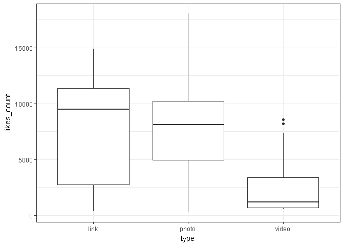
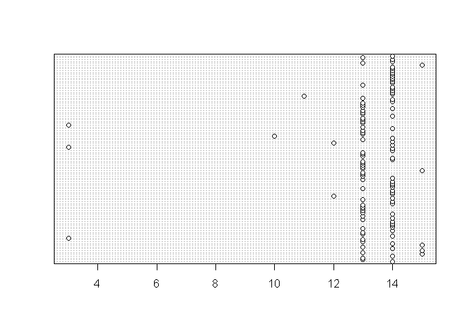

# 期末專題報告

## 題目: 勵志書暢銷的背後，吸引讀者的關鍵為何？

##分析議題背景:

- 在這出版業人人喊苦,書店一間接著一間熄燈(如女書店)的時代,勵志書籍卻能和工具書並駕齊驅甚至高居排行榜不下
- Peter Su 是近年暢銷書作家,在百花齊放的社群上有著高人氣而出版的著作有著驚人的銷量                          
- 文字雲是關鍵詞的視覺化描述，用於匯總用戶生成的標籤或一個網站的文字內容。標籤一般是獨立的詞彙，常常按字母順 序排列，其重要程度又能通過改變字體大小或顏色來表現(維基百科)
- 現今出書一刷2000本能賣完是萬幸的,十萬本的銷量更是遙不可及

## 分析動機:
[話題》勵志散文：在暢銷的背後，讀者追尋的是什麼？](http://www.openbook.org.tw/article/20170225-249) -看到這篇文章覺得很有意思,也想到今年於台北國際書展看到許多勵志書放置在顯眼的平台上,走過去總會忍不住拿起來翻個幾頁或是將封面書腰上的文字快速閱讀過 
-網路上對於此類的書籍評價正反兩極 (正方認為能夠帶來舒緩;反方持無病呻吟的看法) 
-Peter Su能夠在短短一個月55刷衝破10萬本的銷量,不論內容是什麼,總是讓人很好奇,並想一探究竟

## 資料介紹與來源

- 假設:因為Peter Su是先由FB貼文引起關注而逐漸擁有許多粉絲,才得以出書.所以這裡並非分析他的著作,而是想透過其臉書內容來了解其為何能有極大的影響力,甚至是商機.
- 資料為暢銷作家Peter Su的臉書貼文

```r
#install.packages("Rfacebook")  
token<-"EAACEdEose0cBAHZCmmPg8AZAE4VpI2ayMdeAQJTHM3wagNkFAaBDXZCVb9WZBSDAKwBZC3NlDPCiZCJYmYBaDhz9PlaKpqdJU4YEoZCwnJrtBSv8dJy3tiVqsfPM7UBF9Mltmw2s5kharJrtHefE94DJOzNne2QMMHUsx6YjJJf5tRov9lSvWEywmSuRUmj1lsZD" #access token 
library(Rfacebook) 
```

```
## Loading required package: httr
```

```
## Warning: package 'httr' was built under R version 3.3.3
```

```
## Loading required package: rjson
```

```
## Loading required package: httpuv
```

```
## Warning: package 'httpuv' was built under R version 3.3.3
```

```
## 
## Attaching package: 'Rfacebook'
```

```
## The following object is masked from 'package:methods':
## 
##     getGroup
```

```r
lastDate<-Sys.Date() 
DateVector<-seq(as.Date("2017-01-01"),lastDate,by="7 days")  
DateVectorStr<-as.character(DateVector)
totalPage<-NULL
for(i in 1:(length(DateVectorStr)-1)){
    tempPage<-getPage("petesonline", token,
                since = DateVectorStr[i],
                until = DateVectorStr[i+1])
    totalPage<-rbind(totalPage,tempPage)
     Sys.sleep(2)
}
```

```
## 0 posts
```

```
## No public posts were found : petesonline
```

```
## 6 posts 3 posts 7 posts 3 posts 2 posts 7 posts 6 posts 5 posts 4 posts 2 posts 7 posts 5 posts 5 posts 9 posts 3 posts 8 posts 6 posts 4 posts 4 posts 5 posts 4 posts 3 posts 6 posts
```


```r
nrow(totalPage) #有幾筆資料
```

```
## [1] 114
```

## 格式
data.frame 

```r
#先將不需要的欄位清除
totalPage$id <- NULL
totalPage$from_id <- NULL
totalPage$from_name <- NULL
totalPage$link <- NULL
#抓出發文時間
totalPage$time <- substr(totalPage$created_time, start=12, stop=13) 
str(totalPage)
```

```
## 'data.frame':	114 obs. of  8 variables:
##  $ message       : chr  "Bye bye YAP! Heading back to Palau. 再見了雅浦，下次會再回來看你的！回帛琉繼續。\n\n#雅浦群島 #拍攝週三愛玩客" "我們之間的友誼之所以無可取代，並不總是永遠陪在身邊，而是即使隔得再遠也可以透過許多方式彼此分享，從不會因為距離而感到害怕，正因"| __truncated__ "旅行本身是無狀態的，只有你能賦予它那獨一無二的意義，和別人說得沒有關係。\n\n能將喜歡的旅行融入生活裡，真的是一件很幸福的事啊！\"| __truncated__ "堅強的人，不是不會哭，只是比其他人更會隱藏那些情緒，一個人在沒人看得見地方發洩，哭完之後依然重新整理表情，明天繼續出發。\n\n我"| __truncated__ ...
##  $ created_time  : chr  "2017-01-14T14:08:58+0000" "2017-01-12T13:37:52+0000" "2017-01-10T13:07:34+0000" "2017-01-09T14:10:15+0000" ...
##  $ type          : chr  "photo" "photo" "photo" "link" ...
##  $ story         : chr  NA NA NA NA ...
##  $ likes_count   : num  3089 11688 4932 11321 4938 ...
##  $ comments_count: num  6 463 11 57 13 9 8 67 35 7 ...
##  $ shares_count  : num  5 648 58 769 78 57 15 481 234 9 ...
##  $ time          : chr  "14" "13" "13" "14" ...
```

## 分析議題&結果
假設:按讚數.分享數.留言數量越多表示有較高的互動,能帶來的商機.關注也越高
### 1.發文附圖的重要性

- "發文不附圖 此風不可長"就算圖文不符,發文附圖才能引起關注
- 風靡全球的Instagram,其特色就是先以圖片引人注意接著看到下方的文字內容.

```r
#install.packages("ggplot2")
library(ggplot2)
```

```
## Warning: package 'ggplot2' was built under R version 3.3.3
```

```r
ggplot(totalPage,aes(x=type,y=likes_count))+geom_boxplot()+theme_bw() 
```

<!-- -->


### 2.發文好時機
12-14多半是大家午休時間,此時發文是個聰明的選擇

```r
library(ggplot2)
dotchart(as.numeric(totalPage$time))
```

<!-- -->


### 不同發文類型的關注度

```r
mean(totalPage$likes_count)  #平均每篇貼文的讚數
```

```
## [1] 7097.342
```

```r
mean(totalPage$comments_count) #下方留言平均數
```

```
## [1] 58.5614
```

```r
mean(totalPage$shares_count) # 分享次篇貼文的次數
```

```
## [1] 345.2281
```

```r
range(totalPage$shares_count)
```

```
## [1]    0 1589
```

```r
library(dplyr)
```

```
## Warning: package 'dplyr' was built under R version 3.3.3
```

```
## 
## Attaching package: 'dplyr'
```

```
## The following objects are masked from 'package:stats':
## 
##     filter, lag
```

```
## The following objects are masked from 'package:base':
## 
##     intersect, setdiff, setequal, union
```

```r
totalpage_test <- NULL
totalpage_test <- totalPage
totalpage_test %>% 
  group_by(type) %>%   
          summarize(num_likes = mean(likes_count),
                    num_comment = mean(comments_count),
                    num_share  = mean(shares_count)) %>%
                  arrange(desc(num_likes))
```

```
## # A tibble: 3 × 4
##    type num_likes num_comment num_share
##   <chr>     <dbl>       <dbl>     <dbl>
## 1 photo  7891.605    60.15116  362.7209
## 2  link  7347.417    50.00000  564.2500
## 3 video  2640.625    56.43750   86.9375
```


##  什麼詞彙會刺激大家的額葉? 正能量或負能量?
"旅行" "夢想" "出發"" 等傳遞正能量的字眼,或許這些詞彙(故事)能減少生活的厭世感

```r
#install.packages("rJava")
#install.packages("Rwordseg", repos="http://R-Forge.R-project.org")
#install.packages("tm")
#install.packages("tmcn", repos="http://R-Forge.R-project.org", type="source")
#install.packages("wordcloud")
#install.packages("XML")
#install.packages("RCurl")
#install.packages("RPostgreSQL")
#devtools::install_github("lchiffon/wordcloud2")
#install.packages("htmlwidgets")
#devtools::install_github('ramnathv/htmlwidgets')
options(java.home="C:\\Program Files\\Java\\jre1.8.0_60")
#Sys.setenv(JAVA_HOME="C:\\Program Files\\Java\\jre1.8.0_60\\bin")
library(tm)
```

```
## Warning: package 'tm' was built under R version 3.3.3
```

```
## Loading required package: NLP
```

```
## 
## Attaching package: 'NLP'
```

```
## The following object is masked from 'package:ggplot2':
## 
##     annotate
```

```
## The following object is masked from 'package:httr':
## 
##     content
```

```r
library(tmcn)
```

```
## # tmcn Version: 0.1-4
```

```r
library(rJava)
library(Rwordseg) # 斷詞工具
```

```
## # Version: 0.2-1
```

```r
library(wordcloud)
```

```
## Warning: package 'wordcloud' was built under R version 3.3.3
```

```
## Loading required package: RColorBrewer
```

```r
# 過濾器設定
library(XML)
```

```
## Warning: package 'XML' was built under R version 3.3.3
```

```r
library(wordcloud2)
# 建立文本物件
insertWords(toTrad(iconv(c("有一天","並不是","點個頭","不一定","那一年","花了","不喜歡","一開始"),
                         "big5", "UTF-8"), rev=TRUE))
db.stopwords<-data.frame(V1=c("了","的","https","goo","gl","peter","825","30","要","那就","com","tw","00"))
db.stopwords$V1<-as.character(db.stopwords$V1)
if (length(colnames(db.stopwords)) > 0) {
  my.stopwords <- c(stopwordsCN(), stopwords("english"), db.stopwords[,1])
} else {
  my.stopwords <- c(stopwordsCN(), stopwords("english"))
}
totalPage$message<- enc2utf8(totalPage$message)
totalPage$message<- totalPage$message[Encoding(totalPage$message)!='unknown']
head(segmentCN(totalPage$message))
```

```
## [[1]]
##  [1] "Bye"     "bye"     "YAP"     "Heading" "back"    "to"      "Palau"  
##  [8] "再"      "見"      "了"      "雅"      "浦"      "下次"    "會"     
## [15] "再"      "回"      "來"      "看"      "你"      "的"      "回"     
## [22] "帛"      "琉"      "繼續"    "雅"      "浦"      "群島"    "拍攝"   
## [29] "週"      "三"      "愛"      "玩"      "客"     
## 
## [[2]]
##  [1] "我們"      "之間"      "的"        "友誼"      "之所以"   
##  [6] "無可"      "取代"      "並"        "不"        "總是"     
## [11] "永遠"      "陪"        "在"        "身邊"      "而是"     
## [16] "即使"      "隔"        "得"        "再"        "遠"       
## [21] "也"        "可以"      "透過"      "許多"      "方式"     
## [26] "彼此"      "分享"      "從不"      "會"        "因為"     
## [31] "距離"      "而"        "感到"      "害怕"      "正"       
## [36] "因為"      "還"        "有"        "你"        "才"       
## [41] "變"        "得"        "更加"      "勇敢"      "Instagram"
## [46] "peter"     "825"      
## 
## [[3]]
##  [1] "旅行"      "本身"      "是"        "無"        "狀態"     
##  [6] "的"        "只有"      "你"        "能"        "賦予"     
## [11] "它"        "那"        "獨一無二"  "的"        "意義"     
## [16] "和"        "別人"      "說"        "得"        "沒有"     
## [21] "關係"      "能"        "將"        "喜歡"      "的"       
## [26] "旅行"      "融入"      "生活"      "裡"        "真的"     
## [31] "是"        "一件"      "很"        "幸福"      "的"       
## [36] "事"        "啊"        "拍攝"      "週"        "三"       
## [41] "愛"        "玩"        "客"        "帛"        "琉"       
## [46] "Instagram" "peter"     "825"      
## 
## [[4]]
##  [1] "堅強"      "的"        "人"        "不"        "是"       
##  [6] "不"        "會"        "哭"        "只"        "是"       
## [11] "比"        "其他"      "人"        "更"        "會"       
## [16] "隱藏"      "那些"      "情"        "緒"        "一個"     
## [21] "人"        "在"        "沒"        "人"        "看得見"   
## [26] "地方"      "發"        "洩"        "哭"        "完"       
## [31] "之"        "後"        "依然"      "重新"      "整理"     
## [36] "表情"      "明天"      "繼續"      "出發"      "我"       
## [41] "與"        "我"        "的"        "孤獨"      "雖"       
## [46] "敗"        "猶"        "榮"        "Instagram" "peter"    
## [51] "825"      
## 
## [[5]]
##  [1] "曾經"      "夢想"      "著"        "像"        "電影"     
##  [6] "一樣"      "抬"        "著"        "頭等"      "著"       
## [11] "雪"        "降落"      "在"        "臉上"      "長大"     
## [16] "後"        "有"        "了"        "機會"      "遇見"     
## [21] "雪"        "觸"        "碰到"      "時"        "才"       
## [26] "驚"        "覺"        "原來"      "只"        "要"       
## [31] "將"        "它"        "埋"        "進"        "心中"     
## [36] "相信"      "它"        "試圖"      "去"        "接近"     
## [41] "它"        "有一天"    "夢想"      "還"        "是"       
## [46] "會"        "緩緩"      "地"        "降落"      "在"       
## [51] "你"        "身上"      "Instagram" "peter"     "825"      
## 
## [[6]]
##  [1] "那天"      "忽然"      "一陣"      "大"        "雨"       
##  [6] "淋"        "濕"        "了"        "我們"      "回頭"     
## [11] "看"        "了"        "一下"      "才"        "想起"     
## [16] "自己"      "都"        "忘"        "了"        "小時候"   
## [21] "最"        "喜歡"      "走"        "的"        "那段"     
## [26] "雨"        "後"        "泥濘"      "路上"      "是"       
## [31] "多麼"      "的"        "簡單"      "而"        "快樂"     
## [36] "攝"        "於"        "帛"        "琉"        "卡"       
## [41] "漾"        "島"        "拍攝"      "週"        "三"       
## [46] "愛"        "玩"        "客"        "instagram" "peter"    
## [51] "825"
```

```r
d<-data.frame(table(unlist(segmentCN(totalPage$message))),decreasing =T)
names(d)<-c("word","freq")
d$word<-as.character(d$word)
wordcloud2(d[!d$word %in% my.stopwords & d$freq>5 & nchar(d$word)>1,], 
           fontFamily = "Microsoft JhengHei", minRotation = -pi/2, maxRotation = -pi/2)
```

<!--html_preserve--><div id="htmlwidget-3f0fb5ac5ed628362df5" style="width:672px;height:480px;" class="wordcloud2 html-widget"></div>
<script type="application/json" data-for="htmlwidget-3f0fb5ac5ed628362df5">{"x":{"word":["bossini","Instagram","MO","PeterSu","Weibo","一件","一段","一個","一起","一樣","十點","下次","大家","不再","什麼","今天","分享","方式","日子","世界","出發","永遠","生命","生活","因為","地方","有人","至少","你們","希望","快樂","我們","沒有","身邊","事情","其實","或許","朋友","狀態","知道","長大","很多","活動","相信","看看","美好","美麗","面對","首播","旅行","時候","時間","海洋","真的","討厭","停止","晚上","現在","許多","這次","這個","這樣","陪伴","喜歡","曾經","森林","無法","無論","發生","感受","路上","夢想","對方","認識","需要","靜靜的","離開","關係","願意"],"freq":[9,75,9,8,7,6,8,25,42,9,7,6,11,9,16,12,7,6,6,34,14,15,8,9,18,8,6,6,8,9,7,38,21,6,7,7,12,14,9,7,9,9,6,7,10,10,6,8,7,33,12,12,6,9,6,7,15,7,6,10,7,9,9,25,7,7,11,10,8,7,8,8,7,7,6,6,9,10,6],"fontFamily":"Microsoft JhengHei","fontWeight":"bold","color":"random-dark","minSize":0,"weightFactor":2.4,"backgroundColor":"white","gridSize":0,"minRotation":-1.5707963267949,"maxRotation":-1.5707963267949,"shuffle":true,"rotateRatio":0.4,"shape":"circle","ellipticity":0.65,"figBase64":null,"hover":null},"evals":[],"jsHooks":{"render":[{"code":"function(el,x){\n                        console.log(123);\n                        if(!iii){\n                          window.location.reload();\n                          iii = False;\n\n                        }\n  }","data":null}]}}</script><!--/html_preserve-->


## 分析結果可能解決的問題 
*究竟是甚麼題材內容能夠讓大眾深深被吸引,造成一股旋風.
*或許就如"看到的人會幸福吧"的概念,勵志書以作者真實的經驗來幫讀者找到抒發情緒的出口，陪同讀者走過低潮
*一眼抓住讀者目光的詞彙
*從中可以察覺到出書代言葉配的商機並非偶然 

## 組員名單與分工
胡茹芳—— 滷得很入味的魯蛇

[wordcloud](https://drive.google.com/open?id=0Bwv7NFD7P2fyUzZOSkVCWDJKaEU)
